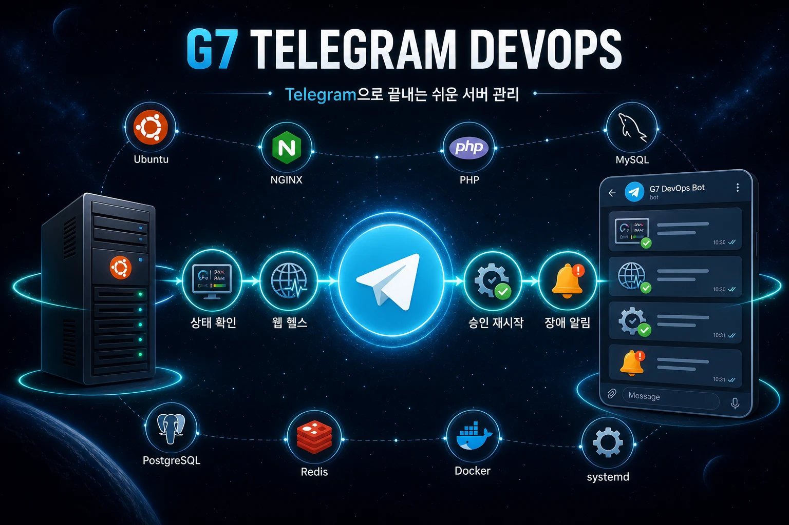

# G7Telegram DevOps

> [!WARNING]
> **무보증 및 책임 제한:** 이 공개 Beta는 Apache License 2.0에 따라 **있는 그대로(AS IS)** 제공되며 특정 목적 적합성, 무중단 운영이나 오류 없음이 보증되지 않습니다. 서버 점검·서비스 재시작 과정에서 중단, 설정 오류 또는 데이터 손실이 발생할 수 있으므로 사용자가 사전 백업과 비핵심 서버 검증을 수행해야 합니다. 관련 법률이 허용하는 범위에서 저작권자와 기여자는 사용 또는 사용 불능으로 발생한 손해를 책임지지 않습니다. 설치기는 이 고지를 표시하고 `Y`로 확인한 경우에만 진행합니다.

> 공개 베타 `v0.6.1-beta.4`: 실제 서버에 설치할 수 있지만 아직 `1.0` 정식판은 아닙니다.



Ubuntu VPS 한 대를 Telegram Bot 하나와 연결해 서버 상태, 웹 상태, 서비스 장애를 확인하고 승인 후 서비스를 재시작하는 관리 도구입니다. 중앙 관제 서버는 필요하지 않습니다.

## 5분 설치

### 1. Telegram Bot token 받기

1. Telegram에서 공식 인증 계정 `@BotFather`와 개인채팅을 엽니다.
2. `/newbot`을 보내고 Bot 표시 이름을 입력합니다.
3. `bot`으로 끝나는 영문 username을 입력합니다. 예: `company_vps_devops_bot`
4. BotFather가 발급한 **HTTP API token**을 복사합니다.

VPS 한 대마다 Bot 하나를 권장합니다. token은 Telegram 대화나 GitHub에 올리지 마십시오. 노출됐다면 BotFather에서 `/revoke`로 폐기한 뒤 새 token을 발급받습니다.

### 2. 서버에서 설치 명령 실행

지원 환경은 Ubuntu 22.04 이상 `amd64`, 권장 메모리는 2GB 이상입니다. SSH로 서버에 접속해 다음 명령을 실행합니다.

```bash
sudo apt-get update
sudo apt-get install -y curl ca-certificates
curl -fsSL https://github.com/jiwonpapa/g7Telegram-devops/raw/main/install.sh | sudo sh
```

책임 제한 고지와 초기설정 진행 여부를 확인한 뒤 다음 세 정보만 입력합니다.

- `서버 이름`: Telegram에 표시할 이름입니다. 기본값을 쓰려면 Enter를 누릅니다.
- `Telegram Bot token`: BotFather에서 받은 token을 붙여넣습니다. 숨김 입력이라 화면에 표시되지 않습니다.
- `웹 상태 확인 주소`: 검사할 대표 웹 주소입니다. 필요 없으면 Enter를 누릅니다.

### 3. Telegram 연결

서버 콘솔에 16자리 연결코드가 표시되면 5분 안에 생성한 Bot의 **개인채팅에 연결코드만** 보냅니다. Agent 시작과 네트워크 상태에 따라 답장이 수초 늦을 수 있습니다. **10초 동안 답장이 없으면 같은 연결코드를 한 번만 다시 보내십시오.** 새 코드를 바로 발급하거나 코드를 연속 전송할 필요는 없습니다. `연결 완료`와 Telegram의 `메뉴` 버튼이 보이면 설치가 끝난 것입니다.

<details>
<summary>실제 서버 콘솔 설치 화면 보기</summary>

아래에서 `$` 뒤의 명령만 입력합니다. Bot 이름·ID·연결코드는 서버마다 다릅니다.

```console
$ ssh ubuntu@서버주소

ubuntu@my-vps:~$ curl -fsSL https://github.com/jiwonpapa/g7Telegram-devops/raw/main/install.sh | sudo sh
[중요: 무보증 및 책임 제한]
G7Telegram DevOps 공개 Beta는 Apache-2.0에 따라 '있는 그대로' 제공됩니다.
서비스 중단, 설정 오류, 데이터 손실 등 사용에 따른 위험은 사용자가 검토하고 부담합니다.
사용 전 백업과 비핵심 서버 검증을 권장합니다.
관련 법률이 허용하는 범위에서 저작권자와 기여자는 사용으로 인한 손해를 책임지지 않습니다.
위 내용을 확인했으며 설치를 계속하시겠습니까? [y/N] y
g7telegram-devops_0.6.1-beta.4_amd64.deb: OK
[apt 패키지 설치 로그]
지금 Telegram 초기설정을 시작하시겠습니까? [Y/n] y
서버 이름 [my-vps]:
Telegram Bot token (숨김 입력): [입력해도 화면에 표시되지 않음]
Telegram Bot 확인: 회사 VPS 관리봇 (ID 1234567890)
웹 상태 확인 주소 (선택, Enter=건너뜀): https://example.com
설정 완료: my-vps
웹 상태 검사: https://example.com/
Telegram Bot에 다음 연결코드를 보내십시오: ABCD1234EF567890
연결코드 유효시간: 300초
Telegram 응답은 Agent 시작과 네트워크 상태에 따라 수초 걸릴 수 있습니다.
10초 뒤에도 답장이 없으면 같은 연결코드를 한 번 다시 보내십시오.
Telegram owner 연결을 기다립니다...
```

이 상태에서 Telegram Bot 개인채팅에 `ABCD1234EF567890`을 보냅니다. 10초 후에도 답장이 없을 때만 같은 코드를 한 번 더 보냅니다.

```console
Telegram owner 연결 완료: user ID 123456789, chat ID 123456789
PASS: configuration for my-vps (paired)
Agent health: PASS
Installed g7telegram-devops_0.6.1-beta.4_amd64.deb
```

</details>

## 설치 확인

```bash
g7tg --version
sudo g7tg doctor
systemctl is-active g7tg-agent.service
```

정상 기준은 다음과 같습니다.

- 버전: `g7tg 0.6.1-beta.4`
- 설정 검사: `PASS`
- 서비스: `active`
- Telegram: 개인채팅에 `메뉴` 버튼 표시

문제가 있으면 다음 로그를 확인합니다.

```bash
sudo journalctl -u g7tg-agent.service --since today --no-pager
```

초기설정을 건너뛰었거나 token을 교체해야 하면 다시 실행합니다.

```bash
sudo g7tg setup
```

## 지원 기능

| 구분 | 지원 내용 |
|---|---|
| 서버 상태 | CPU, Load, RAM, Swap, 디스크, uptime, OS, kernel |
| 상태 아이콘 | 🟢 정상, 🟡 주의, 🔴 장애, ⚪ 미설정·미감지로 즉시 구분 |
| 자원 경고 | CPU·Load·메모리·Swap 압박·디스크 장애와 복구 알림 |
| 서비스 | 웹서버, PHP-FPM, DB, 캐시, G7/Laravel systemd 서비스 자동 탐지 |
| 안전한 재시작 | 허용된 `.service`만 표시하고 실행 직전 다시 승인 |
| 웹 상태 | 공개 URL의 HTTP 상태, 응답시간, TLS 인증서 만료 확인 |
| 장애 관리 | 중복 제거, 복구 알림, 1시간·6시간 알림중지 |
| 정기 요약 | 꺼짐, 6시간, 12시간, 24시간 중 선택 |
| 보안 | 개인채팅, 단일 관리자, 16자리 단회 연결코드와 실패 제한 |

GnuBoard 5/7 코어나 PHP를 수정하지 않습니다. GnuBoard 7의 queue, Reverb, Horizon은 일반 systemd 서비스로 확인합니다.

## Telegram 메뉴

```text
메뉴
├─ 서버 상태 ─ 새로고침 / 뒤로가기
├─ 서비스 ─ 이전/다음 ─ 상세 ─ 재시작 ─ 승인 / 취소
├─ 웹 상태 ─ 새로고침 / 뒤로가기
├─ 장애/알림 ─ 알림중지 / 해제
├─ 설정 ─ 정기 상태 요약
└─ Agent 정보 ─ 버전
```

슬래시 명령을 외울 필요 없이 하단 `메뉴`와 화면 버튼만 사용합니다. Telegram은 채팅 폭과 글꼴 크기를 제어할 수 없어 기기에 따라 열 정렬은 조금 달라질 수 있습니다.

## 업데이트와 제거

업데이트는 처음 설치할 때 사용한 짧은 설치 명령을 다시 실행합니다. 설정, Bot token, Telegram 관리자와 상태 DB는 유지됩니다.

프로그램만 제거하고 설정과 상태를 남기려면 다음 명령을 사용합니다.

```bash
sudo apt remove g7telegram-devops
```

Bot token, Telegram 관리자, 상태 DB와 앱 전용 설정·백업까지 완전히 삭제하려면 다음 명령을 사용합니다.

```bash
sudo apt purge g7telegram-devops
sudo rm -rf /etc/g7telegram-devops /var/lib/g7telegram-devops
```

두 번째 명령은 이전 Beta에서 수동으로 생성된 설정 백업까지 지우기 위한 호환 정리입니다. 필요한 설정이 있다면 먼저 별도로 백업하십시오. 특정 버전 설치, 롤백과 owner 교체는 [설치와 운영 문서](docs/OPERATIONS.md)를 확인하십시오.

## 설치 스크립트 검토 후 실행

`curl | sudo sh` 대신 설치 내용을 먼저 확인하려면 다음 방법을 사용합니다.

```bash
curl -fsSLo g7tg-install.sh https://github.com/jiwonpapa/g7Telegram-devops/raw/main/install.sh
less g7tg-install.sh
sudo sh g7tg-install.sh
rm -f g7tg-install.sh
```

설치기는 현재 공개 Beta 버전을 내부에서 선택하고 GitHub Release의 `.deb`와 `SHA256SUMS`가 일치할 때만 `apt`로 설치합니다. 고급 사용자는 `G7TG_VERSION`으로 특정 Release를 지정할 수 있습니다.

## 지원 범위와 제한

- Ubuntu 22.04 이상, `amd64`, systemd
- Nginx, Apache, Caddy, PHP-FPM, MariaDB/MySQL/PostgreSQL, Redis/Memcached
- VPS에서 GitHub와 `api.telegram.org`로 HTTPS 443 outbound 연결 필요
- Agent 메모리 사용량은 운영 VPS에서 약 6~8MB

지원하지 않는 기능:

- 중앙 관제, 다중 서버 통합 화면, 멀티테넌시
- 임의 shell·SQL·파일·SSH·방화벽·사용자 계정 조작
- DB 복원·삭제와 OS 전체 업데이트
- Telegram을 통한 Agent 자체 업데이트
- Agent와 VPS가 함께 중단된 경우의 외부 감지
- `arm64/aarch64`

## 보안과 공개 베타 상태

- Bot token: root 전용 `0600` 파일에 저장
- 설정: `root:g7tg-agent 0640`
- 서비스 재시작: root 소유 exact allowlist와 단회 재승인
- 네트워크: inbound port 없이 Telegram API로 outbound HTTPS만 사용
- 상태 저장: 로컬 SQLite, 감사로그와 알림 outbox 크기 제한

현재 `.deb`와 체크섬은 같은 GitHub Release에서 제공되며 독립 서명은 아직 없습니다. 공개 베타에서는 중요한 서버에 적용하기 전에 비핵심 서비스 재시작과 장애·복구 알림을 확인하십시오. 자세한 내용은 [보안 검토 보고서](docs/SECURITY_REVIEW.md)와 [검증 기준](docs/VERIFICATION.md)을 참고하십시오.

정식판 전에는 독립 Release 서명, 실제 장애·복구 왕복, Ubuntu 22.04 실제 VPS, 24시간 이상 연속 운영 검증이 추가로 필요합니다.

## 문서

- [설치와 운영](docs/OPERATIONS.md)
- [제품 범위](docs/PRODUCT_SCOPE.md)
- [아키텍처](docs/ARCHITECTURE.md)
- [보안 경계](docs/SECURITY.md)
- [보안 검토 보고서](docs/SECURITY_REVIEW.md)
- [단계별 구현계획](docs/IMPLEMENTATION_PLAN.md)
- [검증 기준](docs/VERIFICATION.md)
- [홍보 이미지 3종](docs/assets/README.md)

## 라이선스

Copyright 2026 G7Telegram DevOps Contributors. 이 프로젝트는 [Apache License 2.0](LICENSE)으로 배포합니다. 전체 무보증·책임 제한은 라이선스 제7조와 제8조를 따릅니다. 배포물에는 [NOTICE](NOTICE)를 함께 포함해야 합니다.
