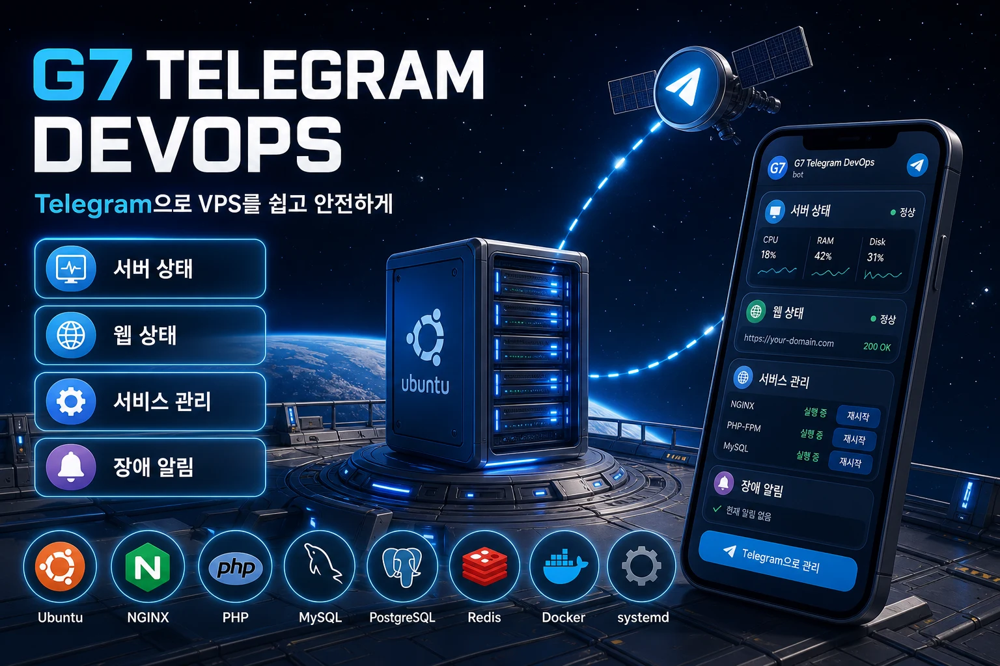
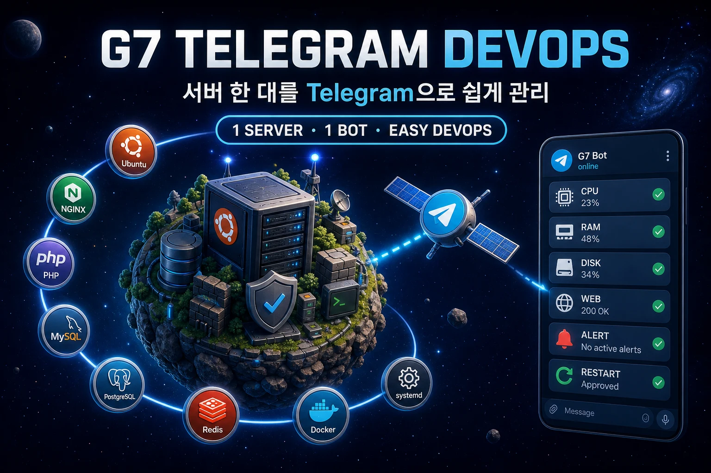

# G7Telegram DevOps 홍보 이미지

모두 1536×1024 비율의 WebP 이미지입니다. README 대표 이미지는 기능 흐름이 가장 명확한 네트워크형을 사용합니다.

## 1. 우주 관제실형

서버 상태, 웹 상태, 서비스 관리와 장애 알림을 실제 Telegram 관리 화면처럼 강조한 기능 홍보용 시안입니다.

## 2. 서버 행성형

`1 SERVER · 1 BOT · EASY DEVOPS` 구조와 지원 기술 스택을 강조한 제품 소개용 시안입니다.

## 3. 네트워크형 — README 대표

한 대의 서버와 Telegram 사이에서 상태 확인, 웹 헬스, 승인 재시작과 장애 알림이 오가는 구조를 한눈에 보여주는 대표 시안입니다.

